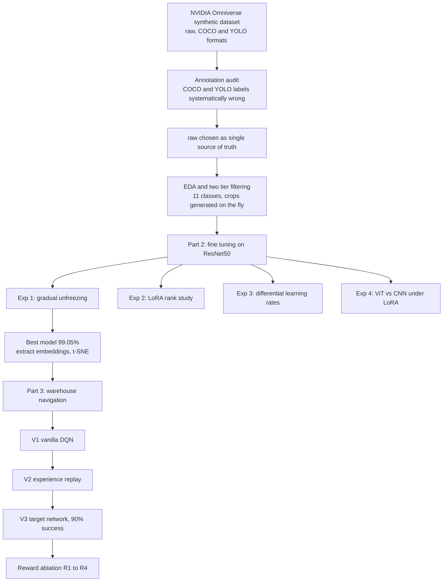

# Advanced Topics in Deep Learning: Warehouse Perception and Navigation

A two part study on a synthetic warehouse dataset generated with NVIDIA Omniverse. Part 2 covers parameter efficient fine tuning and transfer learning for object classification. Part 3 trains a Deep Q Network agent to navigate a custom warehouse environment, reusing the perception model from Part 2 as part of the agent's state.

The interesting parts of this project were rarely the parts that worked first time. A week went into a dataset labelling bug, the differential learning rate experiment behaved the opposite of what I predicted, and the final reinforcement learning agent found a way to farm a reward signal instead of doing what I asked. Those are the bits worth reading.

---

## Headline results

* **Best classifier: 99.05% test accuracy** with progressive unfreezing on ResNet50.
* **LoRA r=32 reached 98.47%** using about 4% of the trainable parameters that full fine tuning needs to reach 98.84%.
* **RL agent went from 0% to 90% success** across the V1 to V3 DQN progression, with each component (replay, target network) earning its place in the results.
* **Found a systematic label bug** in the dataset's COCO and YOLO exports that the canonical raw format did not have.

---

## Project pipeline



---

## Repository structure

```
.
├── part1.ipynb                     warm up CNN on CIFAR-10, environment check
├── part2_EDA.ipynb                 dataset audit, filtering, sample JSON export
├── part_2(cocoFailed).ipynb        the discarded COCO route and the bug proof
├── Part2_Experiments_1.ipynb       gradual unfreezing (A, B, C)
├── part2_experiment_2(LoRA).ipynb  LoRA rank study on ResNet50
├── Part2-linearProbing.ipynb       linear probing baseline
├── Part2_Experiments_3(...).ipynb  differential learning rates
├── Part2_Experiments_4_ViT.ipynb   ViT vs CNN under LoRA
├── part2_EmbeddingsAnalysis.ipynb  mean embeddings and t-SNE on 4 classes
├── Part3_DQN.ipynb                 base DQN setup
├── Part3_DQN_Variants.ipynb        V1, V2, V3 and the reward ablation
├── WarehouseEnv.py                 custom Gymnasium environment
├── images/                         plots used in this README
└── requirements.txt
```

Trained models and embeddings are attached to the repo as a release (Part 2 best model, Part 3 agents).

---

## Part 2: Perception and fine tuning

### The dataset and the bug that cost a week

The dataset ships in three parallel formats: `raw` (the direct Omniverse output as npy plus JSON), `coco`, and `yolo`. I started with COCO since it is the industry standard and `pycocotools` is straightforward.

Halfway through the first linear probing run I did a visual sanity check, pulling a batch from the DataLoader and plotting the denormalised crops against their labels. Crops labelled "pallet" were showing racks. Crops labelled "floor" were showing walls. Not one odd case, the whole dataset.

The decisive test was loading a single image's annotations from all three formats and drawing them side by side. The box coordinates matched across formats, but the class labels in COCO and YOLO were systematically remapped, a bug introduced in the dataset authors' conversion script. I discarded COCO and YOLO and used raw as the single source of truth.

The lesson stuck: a standard format does not guarantee the data inside it is correct, and an LLM will happily confirm that correct code is correct while missing that the data feeding it is wrong.

> **[ INSERT IMAGE: same image annotated from raw vs COCO vs YOLO, side by side, showing the label mismatch ]**
> suggested path: `images/coco_label_bug.png`

### EDA and filtering

The raw format had its own quirks: a generic `data` meta tag concatenated with the real class in inconsistent order, a `barel` typo for `barrel`, and a root primitive whose bounding box covers the entire image. The class imbalance was extreme and the boxes were tiny, median short side of 10 pixels, with 70% of boxes under 20 pixels on the short side. Half the dataset is more than 57% occluded.

A single global size threshold could not work. The `sign` class has a median short side of 3 pixels, so any threshold large enough to clean the physical objects deleted `sign` entirely. The fix was a two tier filter: looser rules for small label like classes (sign, barcode, bottle, paper notes) and stricter rules for physical objects, both capped at 80% occlusion with a minimum sample count per class.

Eleven classes survived: box, ceiling, floor, floor_decal, lamp, pallet, pillar, rack, sign, wall, wire. The EDA notebook saves lightweight JSON pointers (image path, box coordinates, integer label) rather than saved crops, so cropping happens on the fly and the dataset is not duplicated on disk.

> **[ INSERT IMAGE: bounding box short side distribution and occlusion distribution ]**
> suggested path: `images/eda_distributions.png`

> **[ INSERT IMAGE: class counts before and after filtering ]**
> suggested path: `images/class_balance.png`

### Experiment 1: gradual unfreezing

Three transfer learning strategies on ResNet50 (V2 ImageNet weights) over the 11 classes, sharing the same pipeline (batch size 128, 20 epoch budget, early stopping patience 5, AdamW, ReduceLROnPlateau, CrossEntropyLoss). Only the trainable parameters and learning rate changed.

| Variant | Test acc | Test loss | Best epoch | Time (min) | Trainable params |
|---|---|---|---|---|---|
| Linear probing (A) | 95.27% | 0.1586 | 19 | 5.5 | 22.5k |
| Full fine tuning (B) | 98.84% | 0.0518 | 3 | 2.0 | 23.5M |
| Progressive unfreezing (C) | 99.05% | 0.0408 | 8 | 2.2 | 14.9M |

Linear probing reaching 95% without touching the backbone says the ImageNet features already separate these classes well. The prediction that an aggressive learning rate would damage the pretrained weights during unfreezing did not hold: the biggest single class gain came on `wall`, the hardest class, exactly where the backbone needed to adapt.

### Experiment 2: LoRA rank study

LoRA freezes the original weights and learns a low rank correction added at forward time. I applied it to the 9 convolutions of `layer4`, the most task specific block, using HuggingFace `peft` for the final runs.

| Method | Test acc | Trainable params | % of full |
|---|---|---|---|
| Linear probing (A) | 95.27% | 22.5k | 0.10% |
| LoRA r=1 | 97.02% | 52k | 0.22% |
| LoRA r=2 | 97.42% | 82k | 0.35% |
| LoRA r=4 | 97.24% | 141k | 0.60% |
| LoRA r=8 | 97.67% | 260k | 1.10% |
| LoRA r=16 | 98.18% | 497k | 2.12% |
| LoRA r=32 | 98.47% | 972k | 4.13% |
| Full fine tuning (B) | 98.84% | 23.5M | 100% |
| Progressive unfreezing (C) | 99.05% | 14.9M | 63.7% |

LoRA r=32 lands within 0.4 points of full fine tuning using 24x fewer trainable parameters. The diminishing returns are clear, and r=1 still hit 97% with 52k parameters. The open question this left, whether LoRA underperforms here because convolutions are not its native target, is what Experiment 4 answers.

### Experiment 3: differential learning rates

Testing whether splitting the learning rate between backbone and head beats Variant B's uniform rate.

| Config | Test acc | Test loss | Best epoch | Delta vs B |
|---|---|---|---|---|
| Variant B (uniform 1e-4) | 98.84% | 0.0518 | 3 | reference |
| Diff LR 10x | 98.65% | 0.0517 | 4 | minus 0.19 |
| Diff LR 20x | 98.40% | 0.0626 | 5 | minus 0.44 |
| Diff LR 100x | 97.56% | 0.0888 | 12 | minus 1.28 |

Every differential config underperformed, and the gap grew with the ratio. Differential LR assumes the pretrained backbone features are valuable and should be protected from large updates. On this synthetic dataset that assumption fails: most of the accuracy gain comes from moving the backbone, so anything that constrains it costs accuracy. The technique is sound, its domain is just elsewhere.

### Experiment 4: ViT vs CNN under LoRA

Running LoRA in its native home (attention) to settle the Experiment 2 question. I used ViT-B/16 on ImageNet-1k with LoRA on the `out_proj` of the 12 attention blocks.

| Rank | ResNet + LoRA | ViT + LoRA |
|---|---|---|
| 1 | 97.02% | 96.22% |
| 2 | 97.42% | 96.18% |
| 4 | 97.24% | 95.93% |
| 8 | 97.67% | 96.11% |
| 16 | 98.18% | 96.00% |
| 32 | 98.47% | 95.96% |

Two separate effects, easy to confuse. The ViT curve is flat: LoRA in its native setting captures all the useful adaptation at r=1, so adding rank does nothing. The ResNet curve climbs because LoRA on convolutions is a less efficient target that needs more rank. Separately, ViT sits below ResNet at every rank because it lacks the CNN's inductive biases and this is a small synthetic dataset. Read together they look like "LoRA is worse on ViT", which is the wrong conclusion. LoRA is actually more efficient on ViT, the flat curve is rapid saturation. What is worse on ViT is this kind of dataset.

### Embeddings and t-SNE

Loading the best model (Variant C, 99.05%) and extracting 2048 dimensional embeddings via a forward hook on `avgpool` for the four classes Part 3 needs: floor, wall, pallet, sign. t-SNE gave four clearly separated clusters, validating the mean embeddings as class prototypes. Sign and pallet each split into two sub clusters (different shapes and sizes), and wall and floor separated cleanly despite being the hardest pair in the classifier.

> **[ INSERT IMAGE: t-SNE of the four class embeddings ]**
> suggested path: `images/tsne_embeddings.png`

---

## Part 3: Reinforcement learning

The agent navigates a 5x5 warehouse grid to reach a pallet. I structured Part 3 additively so each component motivates the next: vanilla DQN, then replay, then a target network on top.

### The environment

The provided `WarehouseEnv` needed two fixes: a `reset()` method (Gymnasium 1.x requires it explicitly, the skeleton inherited a no op that returned None and crashed) and the reward body. The grid forces the agent down a single narrow corridor between two walls, with a sign in the middle. A random agent reaches the pallet 0% of the time within the 100 step cap, which is the point: a zero floor means any non zero result is genuine learning. An earlier easier grid showed high random success and was discarded.

> **[ INSERT IMAGE: the 5x5 grid layout with corridor, sign and pallet ]**
> suggested path: `images/warehouse_grid.png`

### Variant progression

| Variant | Mean success | Std | Mean episode length |
|---|---|---|---|
| V1 vanilla | 0% | 0% | 100 |
| V2 replay | 40.67% | 44% | 68.9 |
| V3 target network | 90.33% | 13.67% | 18.4 |

**V1** failed identically across all three seeds, climbing to 13 to 18% during high exploration then collapsing to 0% by episode 300, right as epsilon dropped below 0.5 and the agent started trusting its own poorly trained values. The consistency is what made it a structural result rather than bad luck.

**V2** was bimodal: 0% / 94% / 0% on one run, 100% / 22% / 0% on another. Replay breaks the correlation between consecutive transitions, so a seed that stumbled onto the goal early could lock it in, but the moving target problem remains, so whether a seed succeeds depends on luck during early exploration.

**V3** closed the gap with 100% / 71% / 100%. The curves are not monotonic: some seeds sit in a low success valley for 100 to 300 episodes before climbing back. With the target frozen between syncs, the policy can drift but recover instead of locking into a bad equilibrium. That recovery is the clearest signature of why target networks matter.

### Reward ablation

Four reward designs on V3, three seeds each. R1 gives only the goal reward, R2 adds a step penalty, R3 adds a wall bump penalty (the provisional reward used throughout), R4 adds a bonus for standing on a sign tile.

R3 won, which conveniently meant V1 to V3 did not need rerunning. R1 and R2 performed almost identically and clearly worse, showing the wall penalty does most of the work in shaping a stable policy.

R4 is the most interesting result and a failure I did not see coming. It learned aggressively for 100 episodes then collapsed under 1%. With the sign in the corridor, the agent could step on and off it for about +0.45 per pair of steps, roughly +22 over an episode, against a single +10 for reaching the pallet and ending the episode. From the agent's point of view, oscillating on the sign was the better deal. It was doing exactly what the reward told it to. I left it in as a clean example of reward hacking on a grid too small and a reward too simple to prevent it.

---

## What I would do differently

The substantive follow up I designed but ran out of time for is a 50x50 extension of Part 3. In the 5x5 grid the coordinates already encode almost everything the agent needs, so the Part 2 embeddings barely matter. At 50x50 the coordinates become locally uninformative and the agent has to rely on what kind of tile it is standing on, which is where the embeddings would earn their place. Signs would be placed randomly as proper navigational landmarks, with a corrected version of R4 capped at one bonus per sign per episode to remove the oscillation exploit.

---

## Setup

```bash
pip install -r requirements.txt
```

Notebooks were run on Colab with the capped dataset preloaded into RAM, since reading crops from Drive during training was the main bottleneck. Trained models and embeddings are available in the repo release.
